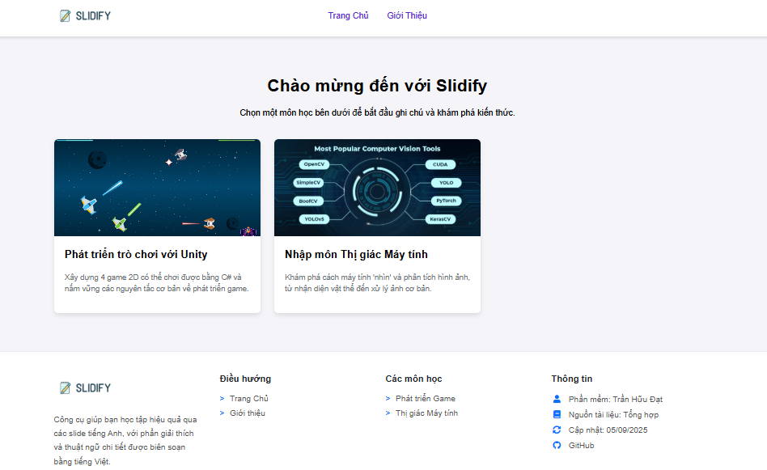

# Slidify - Nền tảng học tập qua Slide

 

**Slidify** là một ứng dụng web tĩnh được xây dựng để giải quyết một vấn đề phổ biến: làm thế nào để học tập hiệu quả từ các bài giảng slide chuyên ngành bằng tiếng Anh? Thay vì chỉ xem slide một cách thụ động, Slidify biến mỗi bài giảng thành một buổi học tương tác với ghi chú, giải thích và thuật ngữ chi tiết bằng tiếng Việt.

Dự án này được xây dựng hoàn toàn bằng **HTML, CSS, và JavaScript thuần túy**, tập trung vào việc tạo ra một trải nghiệm người dùng sạch sẽ, nhanh chóng và hữu ích.

## ✨ Tính năng nổi bật

*   **Giao diện học tập song ngữ:** Hiển thị slide gốc bên cạnh phần ghi chú và giải thích thuật ngữ bằng tiếng Việt, giúp phá bỏ rào cản ngôn ngữ.
*   **Bố cục 2 cột thông minh:** Tự động hiển thị song song Ghi chú và Thuật ngữ khi có, và mở rộng Ghi chú ra toàn bộ không gian khi không có thuật ngữ, tối ưu hóa trải nghiệm đọc.
*   **Theo dõi tiến độ học tập:** Tự động đánh dấu các slide đã xem bằng một dấu tích trực quan. Dữ liệu được lưu vào `localStorage`, giúp bạn không bao giờ mất dấu tiến độ.
*   **Ghi nhớ vị trí:** Khi bạn quay lại một môn học, Slidify sẽ tự động đưa bạn đến slide cuối cùng bạn đã xem.
*   **Điều khiển linh hoạt:**
    *   Dễ dàng di chuyển qua lại giữa các slide bằng nút "Trang trước" / "Trang sau".
    *   Điều chỉnh kích thước slide (50%, 100%) để phù hợp với mọi kích thước màn hình và thị lực.
*   **Giao diện Responsive:** Hoạt động mượt mà trên cả máy tính và thiết bị di động, với hệ thống sidebar trượt (off-canvas) chuyên nghiệp.
*   **Tổ chức nội dung khoa học:** Mục lục được nhóm theo từng tuần/chương và có thể đóng/mở, giúp dễ dàng điều hướng trong các bài giảng dài.
*   **Dễ dàng mở rộng:** Cấu trúc dự án được thiết kế để bạn có thể dễ dàng thêm các môn học mới và các tuần học mới chỉ bằng cách cập nhật tệp `data.js`.

## 🚀 Công nghệ sử dụng

*   **Frontend:** HTML5, CSS3, JavaScript (ES6+)
*   **Thư viện:** Font Awesome (cho các icon)
*   **Lưu trữ phía Client:** `localStorage` để lưu tiến độ và cài đặt của người dùng.

## 🛠️ Cấu trúc dự án

```
/Slidify
|-- index.html              # Trang chủ chọn môn học
|-- subject.html            # Template trang học tập
|-- header.html             # Component header
|-- footer.html             # Component footer
|-- /css
|   |-- main.css            # Style chung
|   |-- homepage.css        # Style cho trang chủ
|   |-- subject.css         # Style cho trang học
|-- /js
|   |-- data.js             # Nơi chứa toàn bộ dữ liệu khóa học
|   |-- script.js           # Logic chính cho trang học
|   |-- main.js             # Logic chung (sidebar...)
|-- /images
|   |-- /game-dev
|   |   |-- /week1          # Chứa ảnh slide của tuần 1
|   |   |-- /week2
|   |-- /computer-vision
|   |-- ...                 # Các ảnh thumbnail, logo...
|-- README.md               # File bạn đang đọc
```

## 🔧 Hướng dẫn cài đặt và sử dụng

Đây là một dự án web tĩnh, bạn không cần bất kỳ server phức tạp nào để chạy nó.

1.  **Clone repository:**
    ```bash
    git clone https://github.com/tranhuudat2004/slidify.git
    ```
2.  **Mở dự án:**
    *   Đi đến thư mục dự án vừa clone.
    *   Mở file `index.html` bằng trình duyệt của bạn.
    *   Cách tốt nhất: Sử dụng một tiện ích server đơn giản như **Live Server** trong Visual Studio Code để trải nghiệm đầy đủ tính năng (đặc biệt là `fetch` các component).

## ✍️ Cách thêm nội dung mới

Toàn bộ "bộ não" của Slidify nằm trong tệp `js/data.js`.

1.  **Để thêm một môn học mới:**
    *   Thêm một cặp key-value mới vào đối tượng `coursesData`. Key là một định danh duy nhất (ví dụ: `machine_learning`).
    *   Cung cấp `title`, `description`, `thumbnail` và một mảng `sections` rỗng.
2.  **Để thêm một tuần học mới:**
    *   Thêm một đối tượng mới vào mảng `sections` của môn học đó.
    *   Cung cấp `title` và một mảng `slides` rỗng.
3.  **Để thêm một slide mới:**
    *   Thêm một đối tượng mới vào mảng `slides` của tuần học.
    *   Cung cấp `id` (duy nhất trong môn học), `title`, `image` (đường dẫn đến ảnh), `notes` (nội dung ghi chú) và `terms` (đối tượng chứa các thuật ngữ).

## 💡 Tác giả

Được tạo ra và phát triển bởi **Trần Hữu Đạt**.

---
*Dự án này được tạo ra với mục đích học tập và quản lý kiến thức cá nhân.*
```

